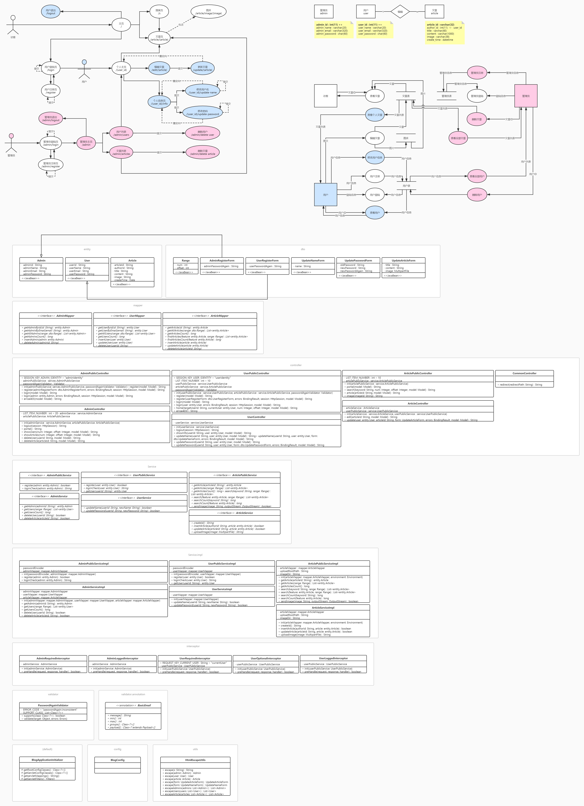

# iBolg
基于 Spring + Spring MVC + MyBatis 搭建的博客平台。

## 功能点
* 用户相关
    * 用户注册
    * 用户登陆
    * 用户退出
    * 个人主页（列出已发布的文章）
    * 个人信息
        * 修改名称
        * 修改密码
    * 管理文章
        * 写文章
        * 修改文章
* 文章相关
    * 博客主页（列出最新文章）
    * 搜索
    * 文章详情
    * 文章图片
* 管理员相关
    * 管理员注册
    * 管理员登陆
    * 管理员退出
    * 管理员门户
    * 管理用户
        * 查看所有用户
        * 删除用户
    * 管理文章
        * 查看所有文章
        * 删除文章

## 实现方式
* 安全
    * 密码：前端采用CryptoJs库进行sha256加密，后端采用SpringSecurity库进行BCrypt加密。
    * 鉴权：通过拦截器检查Session鉴权信息，阻止非法访问。
    * 防XSS攻击：采用Apache的Text库把特殊字符编码为HTML实体。
* 数据
    * 数据源：采用SpringJDBC库和MyBatisSpring库管理数据源（MySQL）。
    * 文件：采用Apache的FileUpload库实现图片上传。
* 视图
    * 模板引擎：JSP。

## 设计图
* PDF：[design/设计图.pdf](design/设计图.pdf)
* JPG：[design/设计图.jpg](design/设计图.jpg)

